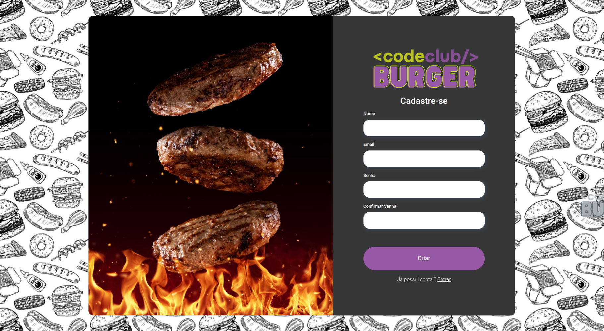
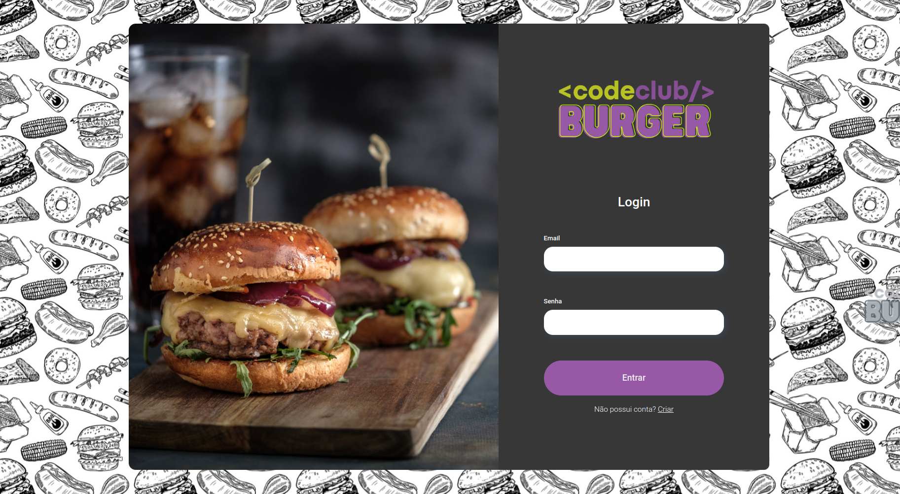
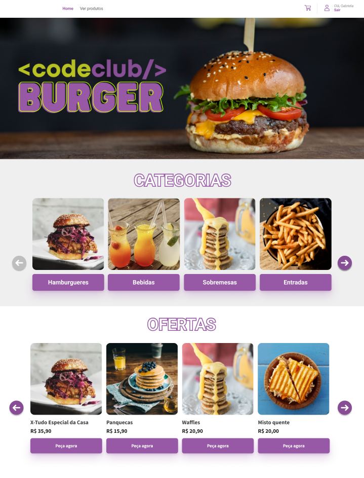
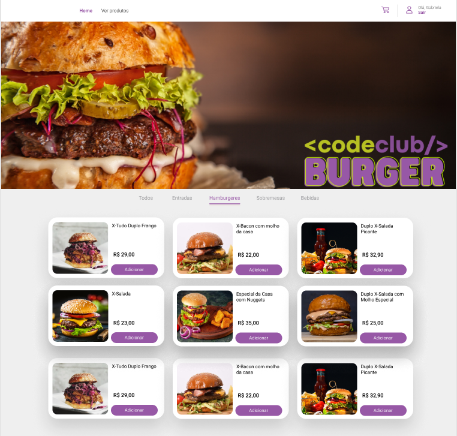
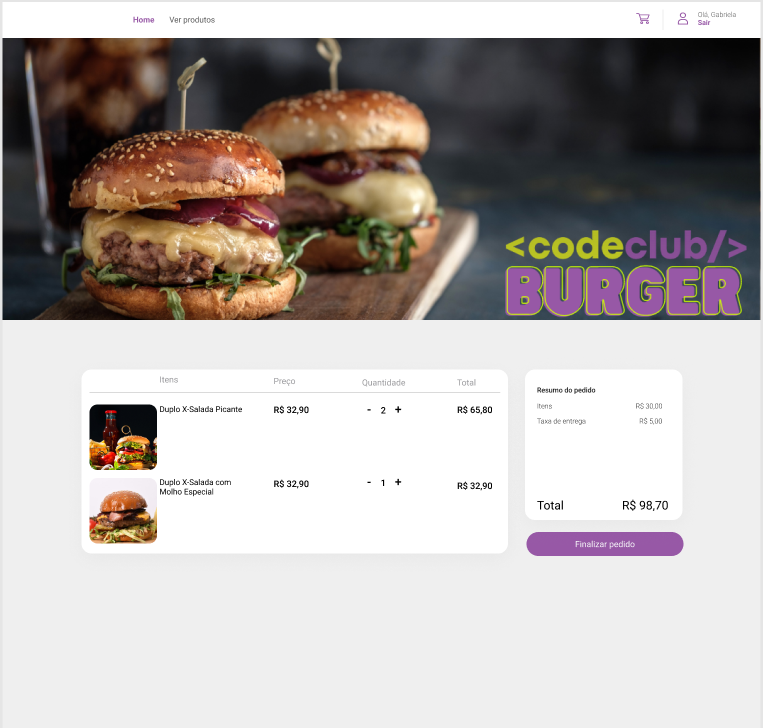
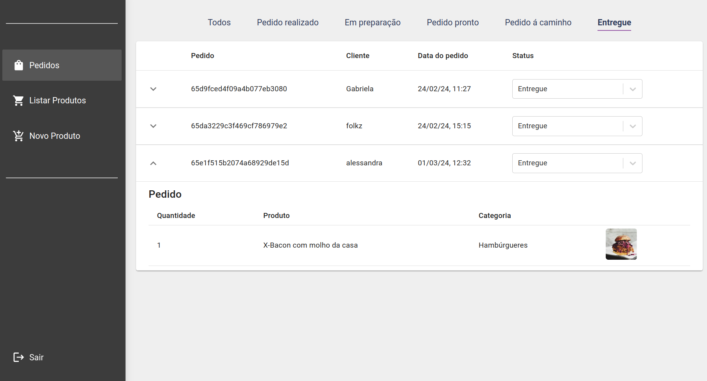
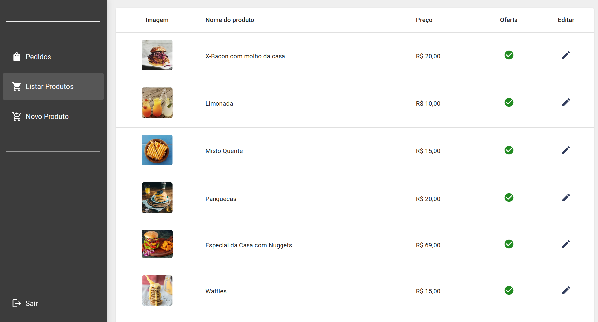
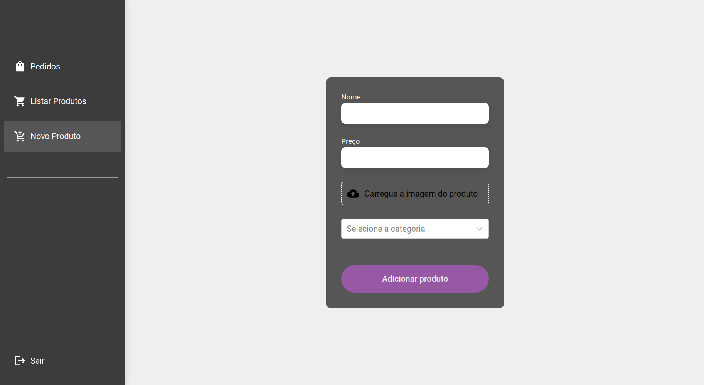

# CodeBurger

CodeBurger é uma aplicação web desenvolvida para simular um sistema de pedidos de hambúrgueres. Ele oferece funcionalidades tanto para clientes quanto para administradores, proporcionando uma experiência de usuário fluida e eficiente.

## Destaques do Projeto
### Cliente:
- Cadastro e login do usuário
- Página principal com navegação intuitiva (carrossel de categorias e ofertas)
- Página de produtos com navegação entre categorias
- Carrinho de compras com adição e remoção de itens
### Administrador:
- Gerenciamento completo de produtos (adição e edição)
- Controle de pedidos com visualização, filtragem e atualização de status

## Tecnologias

- **React**: Flexibilidade na construção de interfaces e arquitetura baseada em componentes
- **React Router**: Gerenciamento fluido da navegação na aplicação
- **Axios**: Comunicação eficiente entre frontend e backend
- **Material-UI**: Componentes estilizados prontos para uso que se integram bem com o React
- **React Hook Form** e **Yup**: Validação de formulários de forma simples e eficiente
- **LocalStorage**: Armazenamento local de dados no navegador do usuário
- **React Toastify**: Exibição elegante de mensagens de notificação

## Repositório Back-end

[Repositório Back-end](https://github.com/gabrielabade/codeburger-backend.git)

## Deploy

O projeto CodeBurger está disponível no seguinte link:

- [CodeBurger - Deploy](https://codeburger-gabrielabade.vercel.app/login)

## Preview

### Painel Cliente

### Painel Administrador

